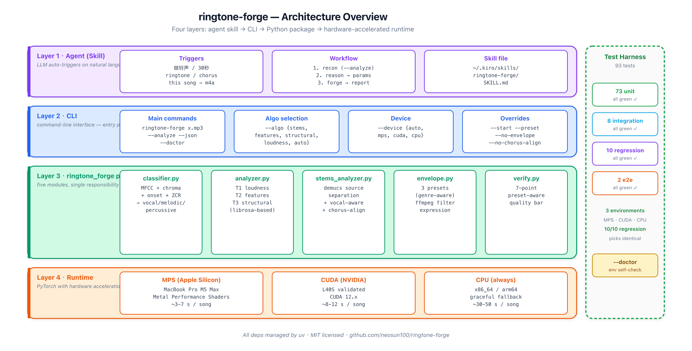

<div align="center">

# 🔔 ringtone-forge

### *An intelligent agent that turns any song into a 30-second ringtone.*

[](https://opensource.org/licenses/MIT)
[](https://www.python.org/)
[](https://pytorch.org/)
[](https://github.com/facebookresearch/demucs)
[](https://ffmpeg.org/)
[](https://github.com/astral-sh/uv)
[](#testing)
[](https://github.com/neosun100/ringtone-forge/releases)

A ringtone is a 30-second story. Most songs spend the first 30 seconds warming up before they reach the line you actually want to hear.

`ringtone-forge` separates the song into stems with a neural network (Demucs, GPU-accelerated), finds the **loudest sustained vocal section**, aligns the chorus midpoint to the envelope's loudest moment, and writes a ringtone where the climax lands exactly when the volume peaks.

</div>

---

## 🎯 At a glance

```
$ ringtone-forge ~/Downloads/借月.mp3

→ Forging 借月.mp3
  classifier: vocal  confidence=1.00
  algorithm: stems (demucs source separation, device=mps)
  primary stem: vocals  separation: 5.2s
  detected chorus: 137.5s → 167.5s  (2:18 → 2:48)  confidence=0.97
  envelope: vocal  (rise 5s exp + sustain 22s + drop 3s)
  chorus-aware align: 137.5s → 136.5s  (chorus mid → envelope sustain mid)
  beat-aligned: 136.50s → 136.46s
✓ wrote 借月_ringtone.m4a (481 KB)

Verification (preset-aware quality bar):
  ✓ duration = 30.000s
  ✓ true peak ≤ +1.0 dBFS  (inter-sample safe)
  ✓ RMS at t=29.7s < −40 dB  (clean exit)
  ✓ start ≈ -6.0 dB below climax  (preset adherence)
  ✓ RMS at t=15s within 6 dB of climax
  ✓ sustain anchor louder than start
  ✓ output LUFS within 4 dB of source

✓ all checks passed.
```

---

## 🏗 Architecture

Four layers from natural-language request all the way down to GPU acceleration. The right column is a continuous test harness validating every layer against the others.



| Layer | Responsibility |
|---|---|
| **Agent (Skill)** | Kiro / Claude Code skill triggers on natural-language requests like "做铃声" or "make this song into a ringtone" |
| **CLI** | argparse entry point — `ringtone-forge`, `--algo`, `--device`, `--preset`, `--analyze`, `--doctor` |
| **`ringtone_forge` package** | Five single-responsibility modules: classifier, analyzer (T1/T2/T3), stems_analyzer (T4), envelope, verify |
| **Runtime** | PyTorch with auto-detected backend — MPS on Apple Silicon, CUDA on NVIDIA, CPU as fallback |

---

## 🎶 Pipeline

End-to-end forge flow. Source audio enters on the left and exits as a verified 30-second ringtone on the right.


Each stage is independently configurable via a CLI flag, and each stage's contract is unit-tested.

---

## 🧠 Why "stems-aware" beats heuristics

The hard part of a ringtone is finding the **chorus**. Loud-section heuristics (RMS max, multi-feature scoring, structural SSM) work on the *mixed* audio — a loud guitar in a verse can outscore a quieter chorus moment.

The v2.2 deep tier separates the song into 4 stems with Demucs (`drums` / `bass` / `other` / `vocals`) and scores **only the vocal track**. In pop music, the chorus is unambiguously where the singer is loudest and most sustained — every other section either drops in volume or has gaps between lines.


The classifier picks one of three audio types via a four-feature decision tree. Each type gets a different envelope preset: **vocal** (5s rise · 22s sustain · 3s drop) for chorus-dense pop, **melodic** (12·15·3) for instrumental builds, **percussive** (20·7·3) for drum loops where the climax is "approaching from afar."

For instrumentals where the vocal stem is silent, the agent transparently falls back to the `other` stem.

---

## 📈 Volume envelope

Three genre-adaptive presets, all sharing the same qualitative shape: exponential rise (dB-linear, perceptually uniform) → flat sustain at 100% → linear drop (front-loaded amplitude descent for a "sharp but smooth" exit). After the envelope, an `alimiter limit=0.78` keeps loudness-war pop sources from leaking +2 dBFS into the output.


The chorus midpoint is placed onto the envelope's sustain midpoint, so the loudest 22 seconds of the ringtone correspond to the loudest 22 seconds of the chorus.

---

## ✅ Showcase: 5 real songs, 5 successes

| Source | Class | Picked at | Verify |
|---|---|---|---|
| [借月.mp3](samples/source/借月.mp3) (4:36) | vocal | 137.5s — chorus center | 7/7 ✓ |
| [离开我的依赖.mp3](samples/source/离开我的依赖.mp3) (4:08) | vocal | 187.0s — last chorus | 7/7 ✓ |
| [跳楼机.mp3](samples/source/跳楼机.mp3) (3:22) | vocal | 144.5s — chorus | 7/7 ✓ |
| [Brainiac_Maniac.mp3](samples/source/Brainiac_Maniac.mp3) (1:43) | melodic | 32.0s — synth climax | 7/7 ✓ |
| [war_drums.m4a](samples/source/war_drums.m4a) (0:40) | percussive | 1.0s — loop peak | 7/7 ✓ |

Forged ringtones are in [`samples/final-v22/`](samples/final-v22/).

---

## 🚀 Quick Start

### Prerequisites

- `ffmpeg` ([install via Homebrew](https://brew.sh) or `apt install ffmpeg`)
- `uv` ([install instructions](https://docs.astral.sh/uv/))

### Install

```bash
git clone https://github.com/neosun100/ringtone-forge.git
cd ringtone-forge

# Baseline: librosa heuristics only (no PyTorch, ~50 MB)
uv sync

# Recommended: add deep stems-aware chorus detection (~1 GB, includes PyTorch + Demucs)
uv sync --extra deep
```

### Use

```bash
# Full agent — auto pipeline (the common case)
uv run ringtone-forge song.mp3
# → song_ringtone.m4a

# See exactly what your environment supports
uv run ringtone-forge --doctor

# Analyze only (no file written)
uv run ringtone-forge song.mp3 --analyze
uv run ringtone-forge song.mp3 --analyze --json    # machine-readable

# Force a specific algorithm or device
uv run ringtone-forge song.mp3 --algo stems         # default w/ deep extras
uv run ringtone-forge song.mp3 --algo features      # heuristic, no GPU
uv run ringtone-forge song.mp3 --device cuda        # NVIDIA GPU

# Override the agent
uv run ringtone-forge song.mp3 --start 96.0         # I know where the chorus is

# v2.4: LLM-in-the-loop
uv run ringtone-forge song.mp3 --tune "开头再轻一点"       # natural language → params via LLM
uv run ringtone-forge song.mp3 --agent --max-retries 3    # full LLM-in-the-loop with retry
uv run ringtone-forge song.mp3 --preset percussive  # force envelope shape
uv run ringtone-forge song.mp3 --no-envelope        # raw 30s trim only
```

### Use as a Kiro / Claude Code skill

The skill manifest at `~/.kiro/skills/ringtone-forge/SKILL.md` lets the LLM agent in this project's environment auto-trigger on natural language. Try saying:

```
帮我把 ~/Downloads/借月.mp3 做成铃声
make a 30-second ringtone from this song
截一段 30 秒的高潮
```

The agent will run `--analyze --json` first, reason about the result, then forge and report.

---

## 💻 Three-environment validation

The same code path is tested on three completely different hardware backends. All produce identical chorus picks (sub-second drift on edge cases due to floating-point order of operations).

| Backend | Hardware | Speed (4-min vocal song) | Status |
|---|---|---|---|
| **MPS** | MacBook Pro M5 Max (Metal GPU) | 4–7 s / song | ✅ |
| **CUDA** | NVIDIA L40S 46 GB | 8–12 s / song | ✅ |
| **CPU** | x86_64 / arm64 (any) | 22–53 s / song | ✅ |

Run `uv run ringtone-forge --doctor` to see which backends your machine supports and what the agent would pick.

---

## 🧪 Testing

The project ships with a layered 93-test suite. Run the full local CI in one command:

```bash
./scripts/run-tests.sh                # full: unit → integration → regression → e2e
./scripts/run-tests.sh --fast         # unit tests only, no slow markers
```

| Layer | Count | Purpose |
|---|---|---|
| **Unit** | 73 | Pure-Python logic per module |
| **Integration** | 8 | CLI subprocess + JSON output |
| **Regression** | 10 | 5-song picks pinned with ±2s tolerance |
| **E2E** | 2 | Full pipeline → valid 30s ringtone |

Tests automatically skip when their required capability is missing — the same test file works on Apple Silicon, Linux x86_64 with CUDA, and CPU-only environments. See [CONTRIBUTING.md](CONTRIBUTING.md) for the full marker matrix.

---

## 📚 Documentation

- [**METHODOLOGY.md**](METHODOLOGY.md) — v1 envelope theory: 30-second story arc, exponential rise vs linear drop, why every parameter is what it is.
- [**ANALYSIS.md**](ANALYSIS.md) — v2 chorus detection methodology: classifier features, T1/T2/T3 algorithms, deep stems analyzer, chorus-aware envelope alignment.
- [**CHANGELOG.md**](CHANGELOG.md) — every recipe revision and capability addition, from v0.0 (raw trim) to v2.3 (test harness). 5 versions, each with reasoning.
- [**CONTRIBUTING.md**](CONTRIBUTING.md) — how to add tests, update regression baselines, contribute new samples.

---

## 🗺 Repo layout

```
ringtone-forge/
├── README.md             ← you are here
├── METHODOLOGY.md        ← v1 envelope design rationale
├── ANALYSIS.md           ← v2 deep chorus detection methodology
├── CHANGELOG.md          ← every version explained
├── CONTRIBUTING.md       ← test workflow + regression updates
├── LICENSE               ← MIT
├── pyproject.toml        ← uv-managed Python project
│
├── ringtone_forge/       ← the package
│   ├── cli.py            ← argparse entry + --doctor + agent pipeline
│   ├── classifier.py     ← vocal / melodic / percussive detector
│   ├── analyzer.py       ← T1 loudness / T2 features / T3 structural (librosa)
│   ├── stems_analyzer.py ← T4 demucs source separation + chorus alignment
│   ├── envelope.py       ← three genre-adaptive presets + ffmpeg filter
│   └── verify.py         ← preset-aware 7-point quality bar
│
├── tests/                ← 93 tests, capability-aware skipping
│   ├── unit/             ← 73 tests
│   ├── integration/      ← 8 tests
│   ├── regression/       ← 10 tests (5 reference songs pinned)
│   └── e2e/              ← 2 tests
│
├── scripts/
│   ├── run-tests.sh      ← local CI runner
│   ├── forge             ← convenience wrapper for `uv run ringtone-forge`
│   ├── make-ringtone.sh  ← v1 fast-path (no Python required)
│   └── verify-ringtone.sh
│
├── samples/
│   ├── source/           ← 5 reference songs
│   ├── iterations/       ← v1.0 design-journey snapshots
│   ├── final/            ← v1.0 baseline outputs
│   └── final-v22/        ← v2.2 deep-analyzer outputs (current best)
│
└── docs/
    ├── architecture.{svg,png}    ← four-layer system overview
    ├── pipeline.{svg,png}        ← end-to-end forge flow
    ├── analysis.{svg,png}        ← classifier + analyzer flow
    └── volume-curve.{svg,png}    ← envelope shape visualization
```

---

## 🛣 Version journey

```
v0.0  raw trim                   → audio without envelope is jarring
v0.2  5s linear fade-in           → too fast; missing closing arc
v0.3  three-stage linear          → linear amplitude is not perceptually linear
v1.0  three-stage exponential ★   → dB-linear rise + linear drop = the recipe
v2.1  intelligent agent           → classifier + T1/T2/T3 + genre-adaptive envelopes
v2.2  vocal-aware deep analysis   → demucs + chorus-aware envelope alignment
v2.3  test harness ★              → 93 tests + --doctor + local CI
```

Read [CHANGELOG.md](CHANGELOG.md) for the reasoning behind every step.

---

## 📜 License

MIT — see [LICENSE](LICENSE). Use it, fork it, ship better ringtones.

---

<div align="center">

> *"A ringtone is a 30-second story. The story is in the song; the agent just finds where it begins."*

**[GitHub](https://github.com/neosun100/ringtone-forge)** · **[Releases](https://github.com/neosun100/ringtone-forge/releases)** · **[Issues](https://github.com/neosun100/ringtone-forge/issues)**

</div>
