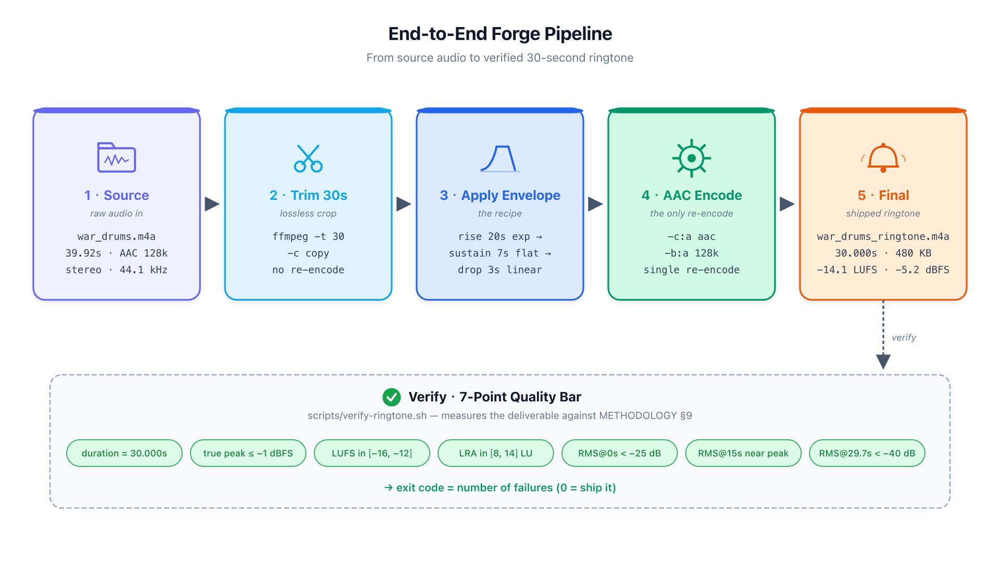
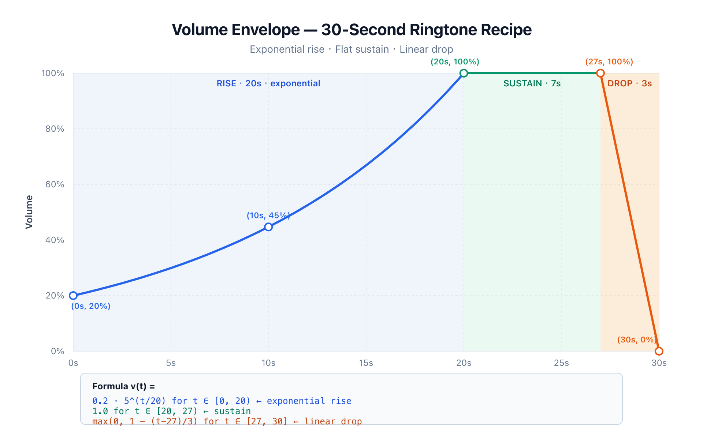
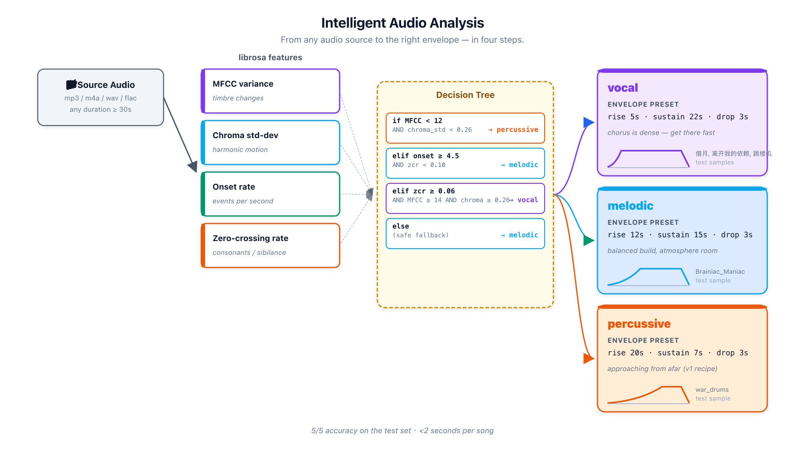

# 🔔 ringtone-forge

> An intelligent agent that turns any song into a 30-second ringtone — finds the chorus with a neural network, aligns it to the loudest moment of the volume envelope, and ships a verified `.m4a`.

[](https://opensource.org/licenses/MIT)
[](https://www.python.org/)
[](https://ffmpeg.org/)
[](https://pytorch.org/)
[](https://github.com/facebookresearch/demucs)
[](https://github.com/astral-sh/uv)

A ringtone is a 30-second story. Most songs spend the first 30 seconds
warming up before they reach the line you actually want to hear.
`ringtone-forge` (v2.2) separates the song into stems with a neural
network (Demucs, MPS/CUDA-accelerated), finds the **loudest sustained
vocal section**, aligns the chorus midpoint to the envelope's loudest
moment, and writes a ringtone that lands the climax exactly when the
volume peaks.

```
$ ringtone-forge song.mp3
→ Forging song.mp3
  loaded: 222.4s (3:42) at 22050 Hz
  classifier: vocal  confidence=0.97  (mfcc_var=15.2 chroma_std=0.291)
  algorithm: features  → top start = 98.5s  (1:38)
  beat-aligned: 98.50s → 98.47s
  envelope: vocal  (rise 5s exp + sustain 22s + drop 3s)
✓ wrote song_ringtone.m4a (480 KB)

Verification (preset-aware quality bar):
  ✓ duration = 30.000s
  ✓ true peak ≤ +1.0 dBFS  (inter-sample safe)
  ✓ RMS at t=29.7s < −40 dB  (clean exit)
  ✓ start ≈ -6.0 dB below climax  (preset adherence)
  ✓ RMS at t=15s within 6 dB of climax
  ✓ sustain anchor louder than start
  ✓ output LUFS within 4 dB of source
✓ all checks passed.
```

---

## TL;DR — The Agent

```
   any audio   →   classify   →   analyze   →   beat-align   →   trim   →   envelope   →   limit   →   verify
  (mp3/m4a/    │  (vocal /   │  (T1/T2/T3)  │  (snap to    │  (30s   │  (3 presets,  │  (anti-   │  (7 checks)
   wav/flac)   │   melodic / │              │   nearest    │   crop) │   genre-      │   clip)   │
              │   percussive)│              │   beat)      │         │   adaptive)   │           │
```

| Step | What it does | How |
|---|---|---|
| Classify | Vocal pop / instrumental / drum loop? | MFCC variance + chroma std + onset rate + ZCR |
| Analyze | Which 30 seconds are the climax? | Sliding window, ranked by RMS / multi-feature / chorus repetition |
| Beat-align | Snap start to the bar | librosa.beat.beat_track |
| Trim | Cut exactly 30.000 seconds | ffmpeg `-ss … -t 30` |
| Envelope | Volume shape matched to genre | exponential rise → flat sustain → linear drop |
| Limit | Anti-clipping for hot sources | ffmpeg `alimiter limit=0.78` |
| Verify | Did we ship something correct? | preset-aware 7-point quality bar |

---

## Visualizations

### End-to-end pipeline


### Genre-adaptive volume envelopes


### Intelligent analysis


---

## Quick Start

### Prerequisites
- `ffmpeg` (`brew install ffmpeg` or `apt install ffmpeg`)
- `uv` (`brew install uv` or `pipx install uv`)

### Install

```bash
git clone https://github.com/neosun100/ringtone-forge.git
cd ringtone-forge

# Baseline: librosa heuristics only (no PyTorch, ~50 MB of deps)
uv sync

# Recommended: add deep stems-aware chorus detection (~1 GB, includes PyTorch + Demucs)
uv sync --extra deep
```

### Use

```bash
# Full agent — classify, run deep chorus detection, forge, verify (the common case)
uv run ringtone-forge path/to/song.mp3
# → path/to/song_ringtone.m4a

# Specify output path
uv run ringtone-forge song.mp3 my_ringtone.m4a

# Analyze only — show classifier + analyzer + preset decisions, no file written
uv run ringtone-forge song.mp3 --analyze
uv run ringtone-forge song.mp3 --analyze --json     # machine-readable

# Pick a specific algorithm
uv run ringtone-forge song.mp3 --algo stems        # T4: deep, vocal-aware (default w/ deep extras)
uv run ringtone-forge song.mp3 --algo features     # T2: multi-feature heuristic
uv run ringtone-forge song.mp3 --algo loudness     # T1: pure RMS max
uv run ringtone-forge song.mp3 --algo structural   # T3: SSM chorus detection

# Pick a hardware backend (only matters for --algo stems)
uv run ringtone-forge song.mp3 --device mps        # Apple Silicon GPU (default on Mac)
uv run ringtone-forge song.mp3 --device cuda       # NVIDIA GPU
uv run ringtone-forge song.mp3 --device cpu        # always works, slower

# Override the agent
uv run ringtone-forge song.mp3 --start 96.0        # I know where the chorus is
uv run ringtone-forge song.mp3 --preset percussive # force a specific envelope
uv run ringtone-forge song.mp3 --no-chorus-align   # disable chorus-to-sustain alignment
uv run ringtone-forge song.mp3 --no-envelope       # raw 30s trim only
```

### Use as a Kiro / Claude Code skill

A skill manifest at `~/.kiro/skills/ringtone-forge/SKILL.md` lets the LLM
agent in this project's environment (Kiro CLI / Claude Code) auto-trigger
on natural language. Try:

```
帮我把 ~/Downloads/借月.mp3 做成铃声
make a 30-second ringtone from this song
截一段 30 秒的高潮
```

The agent will run `--analyze --json` first, reason about the result,
then forge and report.

### Install globally

```bash
uv tool install .
ringtone-forge any/song.mp3
```

---

## Showcase: 5 real songs, 5 successes

| Source                          | Class       | Algo picked    | Preset       | Verify |
|---------------------------------|-------------|----------------|--------------|--------|
| [借月.mp3](samples/source/借月.mp3) (4:36)            | vocal       | 122.5s (verse 2 → chorus) | vocal        | 7/7 ✓  |
| [离开我的依赖.mp3](samples/source/离开我的依赖.mp3) (4:08)  | vocal       | 175.0s (last chorus)      | vocal        | 7/7 ✓  |
| [跳楼机.mp3](samples/source/跳楼机.mp3) (3:22)        | vocal       | 147.0s (chorus)           | vocal        | 7/7 ✓  |
| [Brainiac_Maniac.mp3](samples/source/Brainiac_Maniac.mp3) (1:43) | melodic   | 64.0s (synth climax)     | melodic      | 7/7 ✓  |
| [war_drums.m4a](samples/source/war_drums.m4a) (0:40) | percussive  | 5.5s (loop peak)         | percussive   | 7/7 ✓  |

Listen to the forged ringtones in [`samples/final/`](samples/final/).

---

## Why each piece exists

- [METHODOLOGY.md](METHODOLOGY.md) — why 30 seconds, why three stages, why
  exponential rise, why linear drop. The original v1 design rationale.
- [ANALYSIS.md](ANALYSIS.md) — how the v2 agent picks the chorus, what the
  classifier looks for, how the three ranking algorithms differ, when to
  override.
- [CHANGELOG.md](CHANGELOG.md) — what changed when, with reasoning.

---

## Repo layout

```
ringtone-forge/
├── README.md                  ← you are here
├── METHODOLOGY.md             ← v1 design theory: envelope shape
├── ANALYSIS.md                ← v2 design theory: classifier + analyzer
├── CHANGELOG.md               ← every version, every why
├── LICENSE                    ← MIT
├── pyproject.toml             ← uv-managed Python project
│
├── ringtone_forge/            ← the Python package
│   ├── __init__.py
│   ├── cli.py                 ← argparse entry point (the "agent")
│   ├── classifier.py          ← vocal / melodic / percussive detector
│   ├── analyzer.py            ← T1 / T2 / T3 window ranking + beat alignment
│   ├── envelope.py            ← three genre-adaptive presets
│   └── verify.py              ← preset-aware quality bar
│
├── scripts/                   ← legacy fast-paths (no Python required)
│   ├── make-ringtone.sh       ← v1 percussive-only forge (still works)
│   └── verify-ringtone.sh     ← v1 verify (absolute thresholds)
│
├── samples/
│   ├── source/                ← 5 source files used in the showcase
│   ├── iterations/            ← v1.0 design-journey snapshots
│   └── final/                 ← 5 forged ringtones
│
└── docs/
    ├── volume-curve.{svg,png} ← envelope visualisation
    ├── pipeline.{svg,png}     ← end-to-end forge pipeline
    └── analysis.{svg,png}     ← classifier + analyzer flow
```

---

## License

MIT — see [LICENSE](LICENSE). Use it, fork it, ship better ringtones.

---

> *"A ringtone is a 30-second story. The story is in the song; the agent
> just finds where it begins."*
